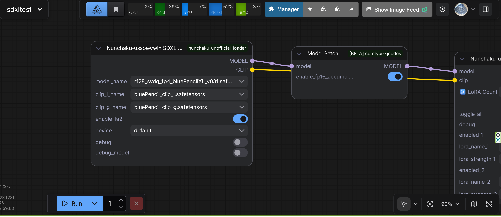

  </img>

<h2>⚠️ WARNING</h2>

This is an <strong>UNOFFICIAL</strong> test version of the node. 
It may not work correctly depending on your environment.

These are Nunchaku unofficial loaders, based on ComfyUI-nunchaku with custom additions.

## Changelog

### Version 2.2

- Added First Block Cache feature for Nunchaku SDXL models
- See [Release Notes v2.2](https://github.com/ussoewwin/ComfyUI-nunchaku-unofficial-z-image-turbo-loader/releases/tag/2.2) for details

### Version 2.1

- Published LoRA Loader technical documentation
- See [Release Notes v2.1](https://github.com/ussoewwin/ComfyUI-nunchaku-unofficial-z-image-turbo-loader/releases/tag/2.1) for details

### Version 2.0

- Added SDXL DIT Loader support
- Added SDXL LoRA support
- Added ControlNet support for SDXL models
- See [Release Notes v2.0](https://github.com/ussoewwin/ComfyUI-nunchaku-unofficial-z-image-turbo-loader/releases/tag/2.0) for details

### Version 1.1

- Added Diffsynth ControlNet support for Z-Image-Turbo models
  - Note: Does not work with standard model patch loader. Requires a custom node developed by the author.
- See [Release Notes v1.1](https://github.com/ussoewwin/ComfyUI-nunchaku-unofficial-z-image-turbo-loader/releases/tag/1.1) for details

### 2025-12-25

- Fixed import error for `NunchakuZImageDiTLoader` node by improving alternative import method with better path resolution (see [Issue #1](issues/1))

## Requirements

**Nunchaku library**: You **MUST** have the Nunchaku library version **v1.1.0 or later** installed. This is a hard requirement - other versions will not work.

**Pre-built package**: For Windows with Python 3.13 and PyTorch 2.9.1+cu130, a pre-built package is available at [ussoewwin/nunchaku-build-on-cu130-windows](https://huggingface.co/ussoewwin/nunchaku-build-on-cu130-windows). This package includes version 1.1.0dev20251224.

**Building from source**: If you use a different environment, you need to build the Nunchaku library from source. The build instructions are not provided in this repository; please refer to the official Nunchaku repository for build documentation.

## Nodes

### Nunchaku-ussoewwin Z-Image-Turbo DiT Loader

⚠️ **WARNING**: This is an **unofficial experimental loader** created as a prototype before the release of ComfyUI-Nunchaku 1.1.0. This is the author's personal testing environment. **Do not use this node.**

A ComfyUI node for loading Nunchaku-quantized Z-Image-Turbo models. This node provides support for loading 4-bit quantized Z-Image-Turbo models that have been processed using SVDQuant quantization.

#### Features

- **Model Loading**: Loads Nunchaku-quantized Z-Image-Turbo diffusion transformer models
- **CPU Offloading**: Automatic or manual CPU offloading support to reduce VRAM usage
- **Memory Management**: Configurable GPU memory usage with transformer block offloading options
- **Hardware Compatibility**: Automatic hardware compatibility checks for quantization support
- **Precision Support**: Supports both INT4 and FP4 quantization precisions

### Nunchaku-ussoewwin SDXL DiT Loader

Important: **Nunchaku / DeepCompressor SDXL SVDQ-FP4 outputs are UNet-only**. They intentionally **do not include CLIP**.

Recommended setup:

- **UNet**: Nunchaku quantized SDXL UNet (`*_svdq_fp4.safetensors`)
- **CLIP**: standard SDXL fp16/bf16 checkpoint (e.g. `sd_xl_base_1.0.safetensors`)
- **VAE**: standard SDXL VAE

The node requires selecting a separate **CLIP checkpoint** because CLIP is not part of the quantized UNet file.

#### Available Quantized Models

Pre-quantized SDXL models are available at:
- **[Nunchaku-R128-SDXL-Series](https://huggingface.co/ussoewwin/Nunchaku-R128-SDXL-Series)** - A collection of high-fidelity quantized SDXL models optimized using Nunchaku (SVDQ W4A4) engine with Rank 128 (r128) quantization.

### Nunchaku-ussoewwin SDXL LoRA Loader

A ComfyUI node for loading and applying LoRA (Low-Rank Adaptation) to Nunchaku quantized SDXL models.

#### Features

- **LoRA Loading**: Loads and applies LoRA files to Nunchaku quantized SDXL UNet models
- **Multiple LoRA Support**: Supports stacking multiple LoRAs with individual strength controls
- **SVDQ Compatibility**: Works with SVDQ quantized UNet models
- **Dynamic UI**: Automatically adjusts the number of visible LoRA slots based on configuration

### Nunchaku-ussoewwin Apply First Block Cache Patch Advanced

A ComfyUI node that implements the First Block Cache feature for Nunchaku SDXL models. This node caches the output of the first Transformer block and skips recalculation when similar, achieving significant speedup during sampling.

#### Features

- **First Block Caching**: Caches the output of the first Transformer block and skips subsequent block calculations when similar
- **Similarity Detection**: Uses normalized error threshold to determine if cached output can be reused
- **Multi-stage Sampler Support**: Automatically detects and disables cache for multi-stage samplers (HeunPP2, Heun++, etc.) to maintain quality
- **Timestep Range Control**: Configurable start and end timestep percentages for cache activation
- **Performance Optimization**: Achieves approximately 1.08-1.8x speedup with Euler samplers
- **Statistics Logging**: Provides detailed cache hit/miss statistics and estimated speedup

#### Usage Notes

- **Residual Diff Threshold**: 
  - `0.0`: Cache disabled (always calculates)
  - `0.12` (SDXL): Approximately 1.8x speedup
- **Sampler Compatibility**: Works best with Euler-family samplers. Multi-stage samplers (HeunPP2, Heun++, etc.) automatically disable cache to prevent image corruption
- **Model Support**: Compatible with Nunchaku SDXL (UNet-based) models

## License

Licensed under the Apache License, Version 2.0. See [LICENCE.txt](LICENCE.txt) for details.
